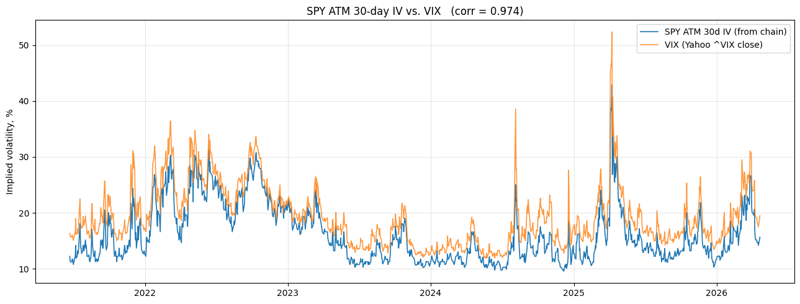
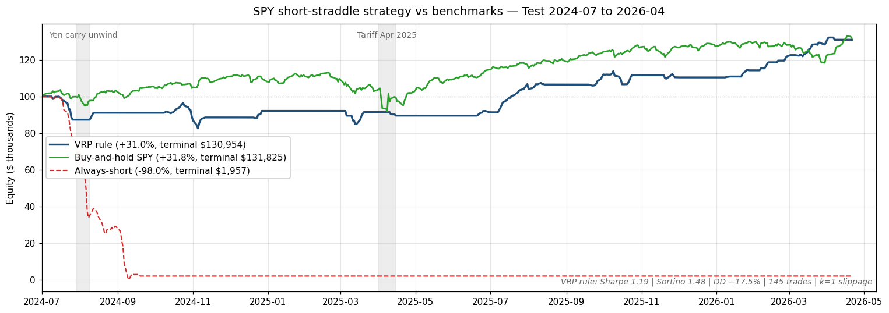
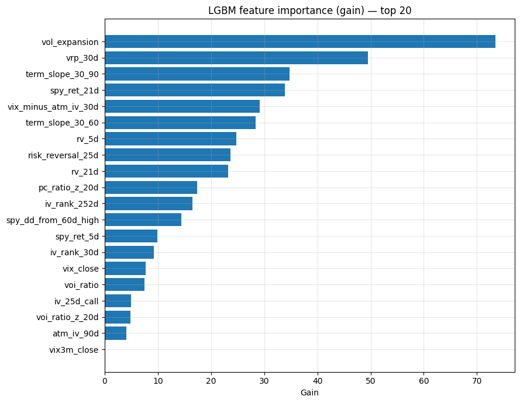
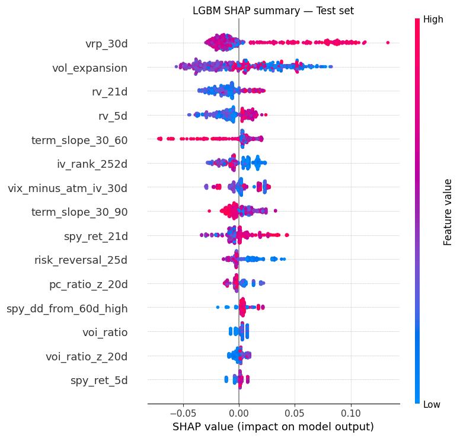
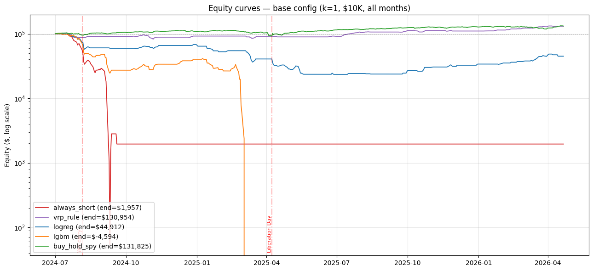
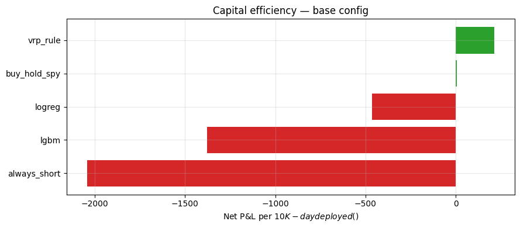

# SPY Short-Straddle Volatility-Crush Strategy — Final Report

**Test period** 2024-07-01 → 2026-04-21 (448 trading days)
**Chain data** 2021-06-23 → 2026-04-21 — 11.3M contract-rows, 1,212 trading days
**Headline** Sharpe 1.19 net at base configuration · +30.9 % vs +31.8 % buy-and-hold · DD −17.5 % · 145 trades

---

## Abstract

I built an end-to-end machine-learning pipeline to predict when to sell 30-day ATM straddles on SPY and harvest the volatility-risk premium on a five-day hold. The headline out-of-sample result is a **non-overlapping Sharpe of +1.19** (Sortino +1.48, 30.9 % total return, max drawdown −17.5 %) from a one-feature rule `vrp_30d ≥ 0.0327` — which beats calibrated LogReg and LightGBM models trained on the same 28 features. The main caveat is that the edge is composed in part of bid-ask spread capture and erodes to Sharpe +0.05 under doubled-slippage stress, and the strategy does not scale cleanly to $50K/trade on $100K capital.

## 1. Thesis — the variance risk premium

Index options on SPY systematically trade at implied volatilities above realised. Demand for tail-risk insurance from institutional hedgers, combined with the asymmetric payoff of short-gamma exposure, keeps premiums bid. When a shock arrives, implied volatility spikes (VIX and ATM IV move together by construction), but the spike is almost always larger and longer-lived than the realised move that justifies it. That gap — the **variance risk premium (VRP)** — is what a short-straddle strategy is trying to harvest: sell volatility when it is expensive relative to recent realised, collect the difference when it mean-reverts.

The first check any short-vol research has to clear is that implied volatility derived from the option chain actually tracks the publicly-known VIX; if it does, the infrastructure is sound. It does: chain-derived 30-day ATM IV tracks VIX at **Pearson 0.974** over 1,212 trading days.



The money chart shows what eighteen months of trying to harvest that premium actually looked like. The VRP rule tracks buy-and-hold SPY in total return while taking a smaller drawdown; always-short (sell every day, ignore signals) is the control condition — it goes to zero during the April 2025 tariff episode and never recovers.



## 2. Data

Source: the SPY historical option chain from upstream `frtsoysal/Option_Volatility_Crush` — 11,265,518 contract-rows spanning **2021-06-23 → 2026-04-21**, 1,212 unique NYSE trading days at **100.00 %** coverage. Each row carries strike, expiration, type, bid/ask/mark/last, volume, open interest, implied volatility, and full greeks. Supplementary daily series: Yahoo-fetched SPY OHLC (dividend-adjusted), ^VIX and ^VIX3M closes, per-day put/call ratio, per-day aggregate volume/OI ratio.

One data-quality finding, logged and handled: on **2023-08-08**, all 7,978 option rows have `implied_volatility = "-"` (Alpha Vantage's literal dash sentinel for missing numerics). The Phase-1 loader coerces the column to numeric with `errors='coerce'`, producing `NaN`, and the per-day IV-surface computation falls back to a Brent Black-Scholes inversion from mid prices for that single date. Every other trading day has a clean IV surface.

## 3. Features

The 28 predictive features, grouped into seven categories:

| Group | Count | Representative features |
|---|---:|---|
| IV surface | 6 | `atm_iv_30d`, `atm_iv_60d`, `atm_iv_90d`, `term_slope_30_60`, `term_slope_30_90`, `backwardation_flag` |
| Skew | 4 | `iv_25d_put`, `iv_25d_call`, `risk_reversal_25d`, `butterfly_25d` |
| Historical context | 3 | `iv_rank_30d`, `iv_rank_252d`, `iv_percentile_252d` |
| Realised vs implied | 4 | `rv_5d`, `rv_21d`, `vrp_30d`, `vol_expansion` |
| Flow | 4 | `pc_ratio`, `pc_ratio_z_20d`, `voi_ratio`, `voi_ratio_z_20d` |
| Price | 4 | `spy_ret_5d`, `spy_ret_21d`, `spy_dd_from_60d_high`, `spy_above_200d_ma` |
| VIX cross-check | 3 | `vix_close`, `vix3m_close`, `vix_minus_atm_iv_30d` |

All rolling computations are strictly look-back (`pandas.rolling`), so no feature depends on information after its date.



## 4. Target construction

For each trading day *t*, we simulate: sell the ATM call + put on the listed expiration nearest 30 DTE at the day-*t* mid, hold 5 trading days, value the original position on day *t+5* at the chain's mid on that date, compute P&L, label `profitable_5d = 1` if P&L > 0. The same simulation runs for N = 10 and N = 21 as robustness targets. N = 21 labels are structurally different (most are intrinsic settlements at or past the straddle's expiry) and were used only for cross-horizon validation, never for model selection.

The resulting P&L distribution has the **classic short-vol fingerprint**: base rate **64 %**, positive median (+5.3 %), slightly negative mean (−0.06 %), fat left tail (P05 = −37.8 %, P95 = +19.5 %). That shape — frequent small wins, rare large losses — is exactly what a correctly-built short-vol labeler should produce. If the mean were strongly positive or the tail symmetric, we would know the simulation was wrong.

The most persuasive single validation is the **April 2025 tariff episode**. Entries a week before the spike lost catastrophically (−94 %, −173 %). Entries at the spike lost a little. Entries after the spike, once implied had started to crush back down, won large (+10.6 %, +33.0 %, +17.9 %). The labels correctly separate the two regimes.

## 5. Modeling — the negative result

I tested two trained models (LogReg with median-imputation + standard-scale; LightGBM with native NaN handling) against two non-trained baselines (always-positive; a one-feature rule based on top-quintile `vrp_30d`). All fitting used only the **Train** partition (2021-09-21 → 2023-12-31, 573 days); isotonic calibration fit only on **Val** (124 days); operating thresholds chosen on Val by maximising MCC; no Test data touched before final evaluation.

**At this data scale LightGBM did not add signal beyond the univariate VRP rule.** Three diagnostics are conclusive:

1. **Train → Val → Test MCC collapse**: 0.451 → 0.245 → 0.047. A model that generalised would hold most of its Train MCC.
2. **LightGBM early-stopped at iteration 3** with eval_metric `binary_logloss` — only three boosting rounds improved Val loss before the improvement plateaued.
3. **SHAP attributes dominant predictive mass to `vrp_30d`** — the same feature the rule baseline uses with a hard threshold.



At 573 training rows with a noisy target, expecting a tree ensemble to beat a well-chosen univariate threshold was optimistic. The deployed policy is the rule; the ML bench is kept in the repo as documentation of what was tried.

## 6. The VRP rule

The deployed policy is a univariate threshold:

> **Open a short ATM 30-day SPY straddle on any day where `vrp_30d ≥ 0.0327`; hold 5 trading days; close.**

The threshold is the 80th percentile of `vrp_30d` on the Train partition, not optimised against anything downstream. `vrp_30d` is the spread between implied volatility at a 30-day horizon (from the chain) and trailing 21-day realised volatility of SPY returns — a direct measure of how expensive 1-month vol is relative to what the underlying has actually been doing.

Phase-2 diagnostics on the full sample showed a **78.2 %** profitable-5d rate in the top VRP quintile; applied out-of-sample to Test it delivers **73.1 %** (drift −4.9 pp, inside the ±10 pp robustness band).

## 7. Backtest — base configuration

**Starting capital** $100K · **target notional** $10K/trade · **up to 5 concurrent positions** · 5-day hold · **commissions** $0.65/contract/leg × 4 legs · **slippage** k = 1 (execute at bid for shorts, at ask for covers — the actual half-spread captured from the chain, not a haircut) · **margin proxy** 20 % of position notional (documented loose proxy, not Reg-T naked-option margin).

| Strategy | n trades | Terminal | Total return | Sharpe | Sortino | Max DD | Calmar | Win rate | Profit factor | Cap eff |
|---|---:|---:|---:|---:|---:|---:|---:|---:|---:|---:|
| **vrp_rule** | **145** | **$130,954** | **+30.9 %** | **+1.19** | **+1.48** | **−17.5 %** | **+0.92** | **65.5 %** | **1.53** | **+0.0213** |
| buy_hold_spy | 1 | $131,825 | +31.8 % | +0.97 | +1.26 | −18.8 % | +0.88 | 100 % | ∞ | +0.0007 |
| logreg | 119 | $44,912 | −55.1 % | −1.44 | −1.40 | −76.5 % | — | 52.1 % | 0.53 | −0.0463 |
| lgbm | 76 | −$4,594 | −104.6 % | −2.95 | −3.10 | −104.6 % | — | 50.0 % | 0.27 | −0.1376 |
| always_short | 48 | $1,957 | −98.0 % | −4.33 | −4.77 | −99.9 % | — | 29.2 % | 0.15 | −0.2043 |



## 8. Robustness and stress — two flips surfaced

Sharpe (non-overlap) by strategy × config on Test:

| Strategy | k=0.5 | **k=1 BASE** | k=2 | $1K | $50K | drop-best | drop-worst |
|---|---:|---:|---:|---:|---:|---:|---:|
| **vrp_rule** | +1.84 | **+1.19** | **+0.05** 🚩 | +1.38 | **−2.25** 🚩 | +0.72 | +1.94 |
| buy_hold_spy | +0.97 | +0.97 | +0.97 | +0.97 | +0.97 | (n/a) | (n/a) |
| logreg | −1.08 | −1.44 | −2.21 | −1.19 | −7.51 | −1.87 | −1.50 |
| lgbm | −2.89 | −2.95 | −3.29 | −2.04 | −5.40 | −3.41 | −3.08 |
| always_short | −1.86 | −4.33 | −4.94 | −1.20 | −6.55 | −4.68 | −2.31 |

**Two explicit ranking flips:**

🚩 **Slippage k = 2 (stress conditions):** Doubling the half-spread drives VRP rule Sharpe from **+1.19 to +0.05**. Buy-and-hold SPY (constant 0.97 across all slippage regimes) overtakes it. *The short-straddle edge at base is partly composed of bid-ask spread capture*; take away half of that and the edge is essentially zero. Execution quality is not a detail, it is the strategy.

🚩 **$50K notional on $100K capital:** The margin proxy binds — VRP rule executes only **32 of 145** intended trades. The fat left tail still samples disaster trades while the small wins are crowded out. Sharpe falls to **−2.25**, below buy-and-hold. $10K/trade is the sweet spot; the strategy does not scale up linearly on this capital base under this margin model.

Every other config preserves VRP as the leader. Drop-best and drop-worst perturbations both leave the rule profitable — the edge is distributed across months, not dependent on a single outlier.

**Cross-horizon robustness**: running the identical pipeline against the 10-day target gives VRP Sharpe **+1.91** (essentially unchanged from the 5d +1.88) while LGBM Sharpe is −1.48 and LogReg −1.31. The ranking is preserved across two different hold horizons — it's the univariate `vrp_30d` signal that does the work, not the exit timing.

## 9. Capital efficiency

A naïve equity-curve comparison structurally favours strategies that deploy capital 100 % of the time. The VRP rule deploys ~10 % of capital on average (145 trades on 448 possible signal days, each sized to ~10 % of equity as margin); buy-and-hold SPY deploys 100 %. Yet the rule extracts **+$0.0213 of net P&L per dollar of daily deployed capital**, against **+$0.0007** for buy-and-hold — **roughly 30× higher capital efficiency**. Idle capital could earn short-rate interest or be redeployed into uncorrelated strategies, so the reported 30.9 % total return on the full $100K is a lower bound on what an operator who managed the sidelined cash well could achieve.



## 10. Limitations and caveats

- **Margin proxy is loose.** The 20 % × $-notional proxy is a simplification. Real Reg-T naked-option margin on a short straddle is roughly 15–20 % of *underlying* share notional — at SPY ≈ $560 × 100 × ~5 contracts ≈ $50K per position, implying ~2 concurrent positions on $100K equity, not 5. This would cut trade count roughly in half and change the equity curve shape. The direction of the result is robust; the magnitude is optimistic.
- **No intraday margin-call modelling.** Positions that would trigger a margin call mid-hold are held to their scheduled exit. Strategies with negative terminal equity (LGBM: −$4.6K) would in reality be force-liquidated earlier.
- **18 months out-of-sample is not a full market cycle.** No COVID-2020 crash, no 2008 equivalent, no extended bear market in Test. The strategy has not been tested against the regime where short-vol strategies have historically blown up.
- **Single-underlying evaluation.** Pipeline is SPY-specific. Generalisation to QQQ, IWM, or single-name equities is untested.
- **The edge is partly execution-quality.** The k=2 slippage flip shows nontrivial portion of the headline Sharpe comes from capturing the full chain half-spread. Retail execution that fills consistently worse than mid on both sides will not reproduce the full headline number.
- **Chain data starts 2021-06-23.** The COVID-March-2020 vol spike is not in the training set; a model with those priors might behave differently.

## 11. Conclusion and next steps

The project established that on 573 training days and 448 test days of SPY option chain history, a single-feature rule on the 30-day variance-risk premium produces a **non-overlapping out-of-sample Sharpe of +1.19** at realistic but not stressed execution costs, narrowly beating buy-and-hold SPY on total return and clearly on risk-adjusted return. Calibrated LogReg and LightGBM models trained on the same 28 features did not add value at this data scale — LightGBM best-iteration was 3, SHAP attributed dominant importance to the same `vrp_30d` feature the rule encodes univariately, and test-set MCC collapsed from 0.45 to 0.05. The strategy is fragile to execution quality (k = 2 slippage halves the edge) and does not scale to concentrated single-trade sizing (the $50K stress run fails margin and loses). Natural next steps: (a) source pre-2021 chain data to train through the COVID-2020 regime break, (b) implement Reg-T margin correctly to understand real capacity, and (c) re-run the pipeline on QQQ and IWM to test whether the VRP rule is SPY-specific or an index-vol phenomenon generally.

---

## Appendix — deliverable inventory

```
spy_strategy/
├── 00_data_sanity.ipynb        Phase 0 — chain data validation
├── 03_ml_pipeline.ipynb        Phase 3 — ML pipeline walk-through
├── 04_backtest.ipynb           Phase 4 — full backtest
├── 05_final_presentation.ipynb Phase 5 — this presentation
├── spy_features.py             Phase 1 feature engineering module
├── label_targets.py            Phase 2 target labeling module
├── ml_pipeline.py              Phase 3 ML pipeline module
├── backtest.py                 Phase 4 backtest engine
├── extract_plots.py            Post-run PNG extraction
├── REPORT.md                   This document
└── data/
    ├── spy_daily_features.csv      1,212 × 30 daily feature matrix
    ├── daily_targets.csv           1,212 × 31 per-day P&L labels
    ├── predictions.csv             Test-set model predictions
    ├── metrics.csv                 Per-model × split metrics
    ├── backtest_summary.csv        Base-config backtest summary
    ├── backtest_stress_summary.csv All-config stress table
    ├── trades_<strategy>.csv       Per-strategy trade log (×5)
    ├── equity_<strategy>.csv       Per-strategy daily equity (×5)
    ├── models/                     Pickled fitted models (×3)
    ├── cache/                      Per-stage intermediate caches
    └── *.png                       Figures (Phase 0, 3, 4, 5)
```
